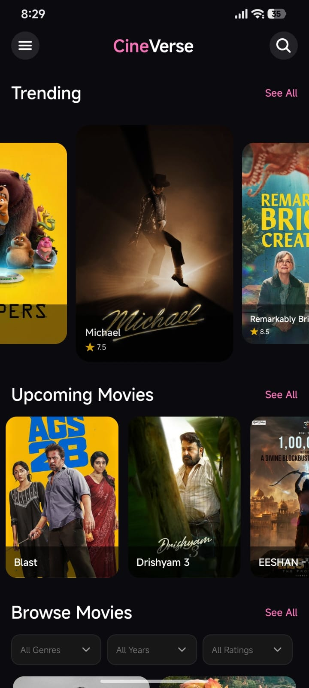
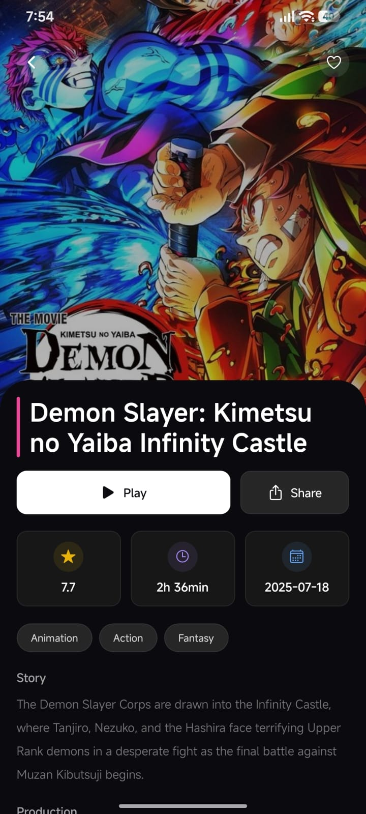
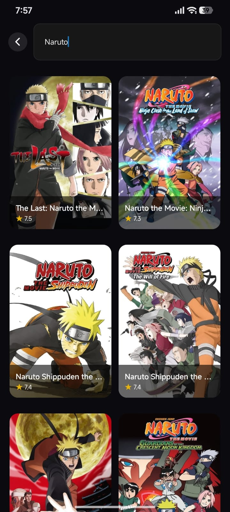
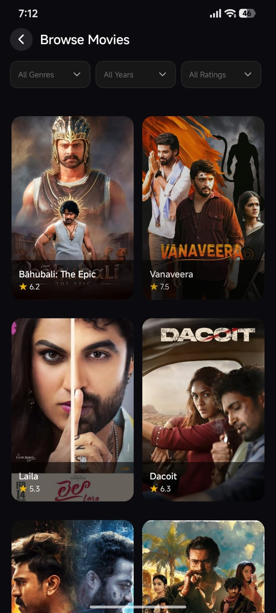
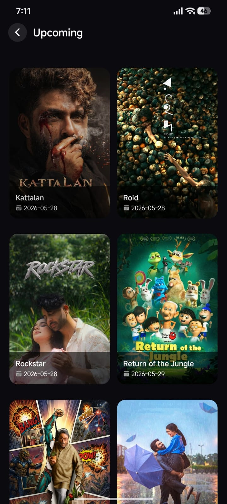
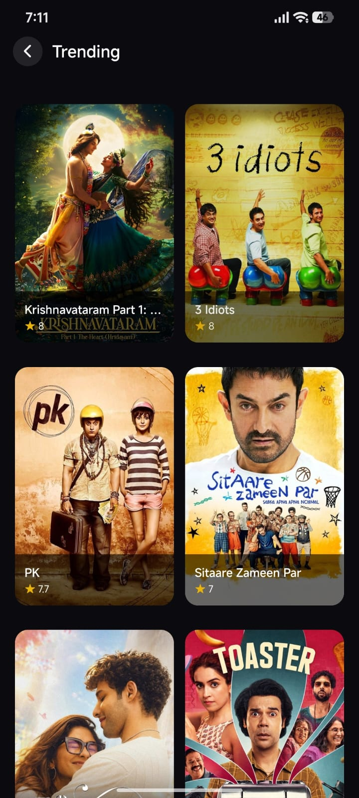
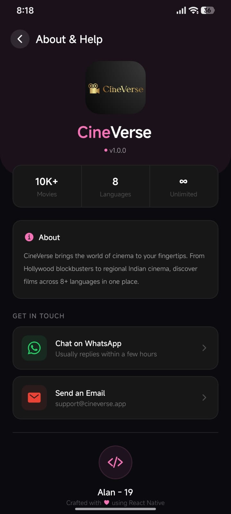

# CineVerse 🎬

A React Native (Expo) movie discovery app built with NativeWind and TMDB API. Browse trending films, check out upcoming releases, search through a massive catalog — all in one place.

<p float="left">
  
  
  
  
  
  
  
</p>

## What it does

- **Trending** — Popular movies from this year, with a carousel on the home page
- **Upcoming** — Films releasing soon, sorted by date
- **Browse** — Filter by genre, year, or rating
- **Search** — Find any movie instantly
- **Details** — Posters, ratings, runtime, synopsis, cast, director/writer with photos, budget & box office
- **Multi-language** — Movies from English, Hindi, Telugu, Tamil, and more
- **Dark theme** — Everything is sleek and dark

## Built with

- React Native (Expo)
- Expo Router (file-based routing)
- NativeWind (Tailwind for RN)
- TMDB API
- TypeScript

## Get started

```bash
npm install
npx expo start
```

Scan the QR code with Expo Go, or press `a` for Android / `i` for iOS simulator.

## Environment

Create a `.env` file in the root:

```
EXPO_PUBLIC_TMDB_API_KEY=your_key
EXPO_PUBLIC_TMDB_ACCESS_TOKEN=your_token
```

Get these from [TMDB](https://www.themoviedb.org/settings/api).

## Project structure

```
src/
├── app/           # Screens (index, search, trending, upcoming, browse, about, movie/[id])
├── components/
│   ├── item/      # MovieCard
│   ├── section/   # TrendingMovie, UpcomingMovies, CategoryMovies
│   └── ui/        # Skeleton loader
├── constants/     # Colors
├── services/      # TMDB API client
└── types/         # Type definitions
```

## Notes

- The splash screen uses the app logo on a black background
- Pull down on the home page to refresh data
- Loading skeletons appear while fetching
- Error states have a retry button

---

Developed by Alan - 19
